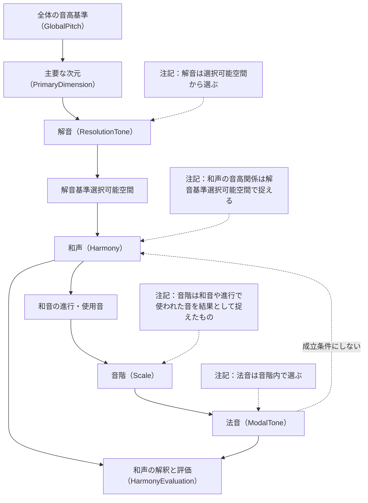
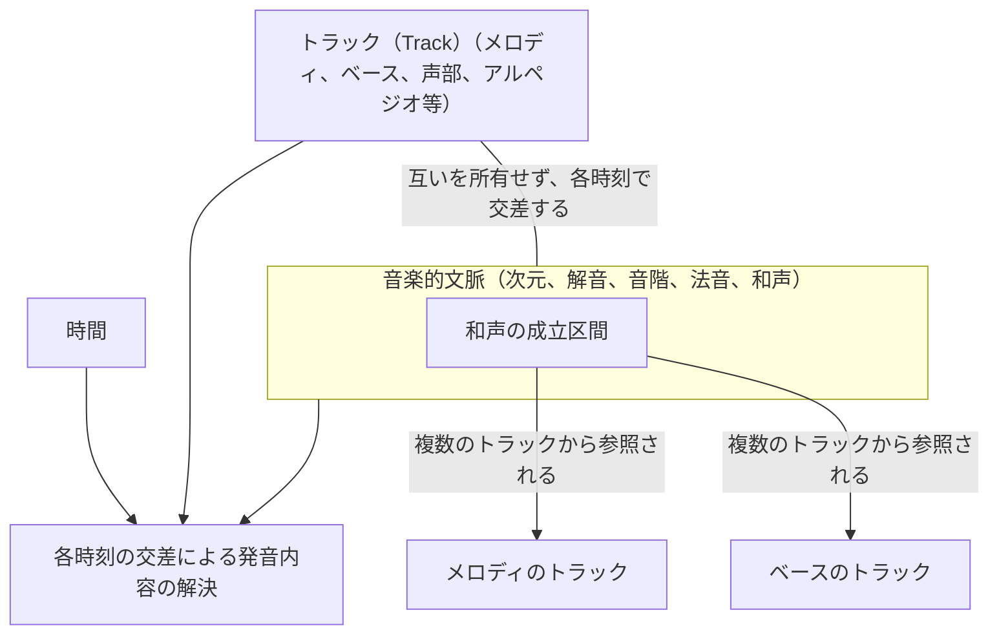
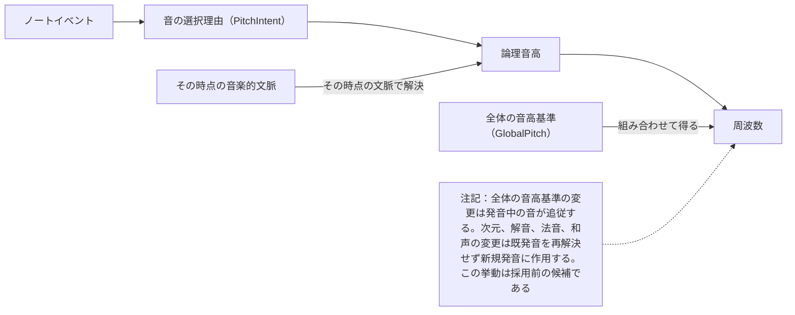

# シャサフ式音楽に基づく意味論的構造

## 目的

XRiftワールドの訪問者が、シャサフ式音楽の和音を直観的に扱って鳴らせる。この文書は、音高・和声の意味、時間とパートとの関係、発音時と発音後に何が保たれるかを扱う。全体の目的と完成形は親の文書と Vision を参照する。

由来の詳細は研究文書（`research/三軸直交型音楽意味論構造.md`）および理論概要に記録した提唱者の解説動画（`research/shasavistic-music-theory.md` の一次情報）を参照する。

## 全体構造

### 概念の依存関係（図1）

詳細は「音高と音楽的文脈」の各節を参照する。

### 時間・パート・音楽的文脈の関係（図2）

詳細は「時間とパート」の各節を参照する。

### 発音内容の解決（図3）

詳細は「発音」の各節を参照する。

### 音高の基準と次元

図1の全体の音高基準と主要な次元の関係を参照する。

- 音楽上の音高関係を保ったまま、全体の音高の基準(GlobalPitch)を変えられる。
- 選択可能な主要な次元は3, 4, 5次元。(長期的には拡張する可能性もある)
- 同じ音楽的文脈の選択可能空間では、1次元・2次元とともに、3次元以上から選んだ一つの主要次元を用いる。3次元以上の複数の次元を同時に含めることは通常の扱いとしない。
- 主要次元は節や音符単位で切り替え可能 (任意秒ではない)

### 解音

選択条件は図1の注記を参照する。

- 解音は、全体の音高基準に対応する位置を参照点として、1次元・2次元・選択した主要次元に対応する方向で扱える相対音高空間次元部分格子の各点から選べる。
  - この部分格子を以降 `選択可能空間` と呼ぶ。相対音高空間、次元番号と素数軸の対応、部分格子の定義は [相対音高空間](../reference/relative-pitch-space.md) を参照する。
- 全体の音高基準が変わってもその関係を保ち、特定の絶対周波数に固定されない。
- 解音は主要次元に従属するため、主要次元が変わる場合その次元を選択次元とした選択可能空間から再度選択する必要がある

選択可能空間上では、全体の音高基準に対応する位置を参照点として解音を選ぶ。この選択可能空間を、選ばれた解音を基点として音高の位置関係を読むとき「解音基準選択可能空間」と呼ぶ。扱える点の範囲は選択可能空間と同じであり、別の部分格子を増やすものではない。相対音高空間の数学的原点、物理的な全体の音高基準、選ばれた解音は、それぞれ役割を区別する。

### 和声とその解釈

構造上の位置づけと成立条件は図1を参照する。

- 和声は選択可能空間から、同線音として互いに異なる音を3種以上選んで構成し、それらの解音からの音高関係を解音基準選択可能空間で捉える。
- 音の意味上の同一性では、整数オクターブ離れた音を同線音として同一視する。実際に鳴らす音の高さや配置を選ぶボイシングでは、その違いを区別できる。
- この文書では、通常の和声について、和声内の基礎音を**機能根**とし、機能根に対する司次元の構成音を**司音**、客次元の構成音を**客音**として扱う。これらは基本となる音の関係を示し、構成音がこの3種だけに限られることは意味しない。

> 未決定: 3次元以上の複数の次元を併用する例外の採否と条件。現時点では通常の選択可能空間に含めない。

### 音階

図1の和音の進行・使用音から音階へ至る関係を参照する。

- 選択可能空間で扱える音高の全体と、和音やその進行で使われた音を結果として捉える音階を、別の概念として区別できる。選択可能空間や解音が定まるだけで、音階の構成音が一意に決まるとはしない。
- 和音や進行を扱うために、音階の構成音をあらかじめ確定しておくことを必須の前提としない。

> 未決定: 音階の定め方は一旦保留とする。上の要具体化が解けるまで、音階の扱いを確定しない。

### 法音

選択条件は図1の注記を参照する。

- 和音や進行から音階を捉えた場合、法音を定めるときはその音階に含まれる音を対象とする。

> 未決定: 音階の定め方を保留としたため、音階に依存する法音も同様に保留とする

## 時間とパート

### 文脈の変化

音楽的文脈の位置づけは図2を参照する。

- 次元・解音・法音・和声は必ずしも同時刻に変化せず、各時点で整合する状態として扱える。

### 和声の成立区間

和声の成立区間と複数パートからの参照は図2を参照する。

- 和声はある時間範囲で成立し、同じ時間の異なるパートから参照できる。

### パートと文脈

パートと文脈の所有関係は図2を参照する。

- メロディー・ベース等のパートは和声や法音に固定的に所属せず、各時点の音楽的文脈を参照できる。
- メロディーはスケールの導出方法が固まるまで保留とする
- ベースはメロディーよりは和音に近いが、長期での運用方針は保留する
  - 短期においてはそのタイミングでの和音の構成音を参照することを想定する

> 要具体化: 各パートが参照できる対象と具体的な発音・編集能力。

## 発音

### 音の選択と発音時の解決

解決の流れは図3を参照する。

- 音を選んだ際の音楽的な参照関係を、実際に鳴る音高と区別して扱える。新たな発音はその時点の文脈に従う。

> 要具体化: 使用できる参照形式。

### 発音後の変更

変更時の追従範囲は図3の注記を参照する。

> 要具体化: 発音後の変更挙動は採用前の候補であり、採用には人間の判断が要る。

> 要具体化: 持続・減衰中の対象、変更の滑らかさ、打楽器の扱い。

## 優先順位と許容する調整

- 全領域間の順位は親の文書を参照する。

> 要記入: 意味論的構造の領域内の優先順位と許容する調整。

## 対象範囲・非目標

### 対象範囲

音楽的な意味論的構造（音高基準・次元・解音・音階・法音・和声とその解釈、時間・パート・文脈の関係、発音時の解決）を対象とする。音色・ドラム等の音源、シーケンサーの操作・再生機能はこの文書の対象とせず、親の他領域を参照する。

> 要記入: この文書が提供する操作・表示・保存の範囲（作成・保存・再生のどこまで）。

### MVPの静的和音とベース

- MVPの短期体験では、時間に沿った変化を含まない和音とベースを扱う。メロディー、および時間・トラックとの交差による発音内容の解決は、この能力に含めない。
- この静的な和音とベースの音高は、解音を基準として定める。
- 機能根の位置は解音からの相対移動で表す。他の和音構成音とベースの位置は、機能根からの相対移動で表す。相対移動は、[相対音高空間](../reference/relative-pitch-space.md)で選択可能空間を定める各次元（1次元・2次元・選択した主要次元）の整数移動量とする。
- ベースは、音高の表現を和音構成音と共通にしながら、発音上の役割として区別して扱える。
- 和声の成立条件は「和声とその解釈」に従う。単音や二音の発音を、成立した和声とは扱わない。
- MVPでは、解音は全体音高基準に対応する位置に固定する。全体音高基準に対応する位置の定めは[親文書](shasavistic-music-world.md)を正本とし、全体の音高基準と解音の役割の区別は保つ。

### 非目標

全体の非目標は親の文書を参照する。

> 要記入: 意味論的構造固有の非目標。
