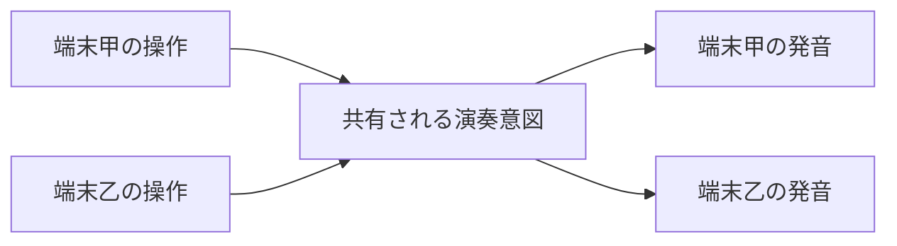

# 格子意図の遠隔共有

この文書は、同じインスタンスの全員が一つの格子を共同操作し、同じ意図から各自が発音する共有方式を決める。共有する意図、所有、状態形、操作の結び付け、同時操作の扱い、音声への反映、開発環境の制約を正本にする。

## 要求元

`requirements/intent/shasavistic-music-world.md` の同期要求（全員が同じ音を聞く、厳密な同期は保証せず簡潔さを優先）を要求元とする。要求を再定義しない。

## 前提

同じインスタンスの全員が一つの格子を共同操作し、共同視聴する。途中参加の端末が共有値を読めることは利用者の確定済み前提として扱い、読めない場合の回復は定めない。ただし共有機構の文書に途中参加の読み保証の明記は確認していないため、厳密な途中参加同期は保証しない（要求の厳密な同期は保証せずによる）。格子・移動・次元切替の意味と操作・音声の分離は親を参照する。

## 確定した方式

共有するのは演奏の意図（選択次元・オンの格子点集合・機能根の座標鍵と由来）だけとする。発振器や実際に鳴っている声は各端末に残し、共有しない。

意図状態の唯一の所有者は、XRift のインスタンス内状態同期（`useInstanceState`、`useState` 互換で関数型更新に対応）に置く。制御器の閉包には置かない。関数型更新の対応は導入済み実装と型定義で確認済み（`@xrift/world-components@0.53.0` の `dist/hooks/useInstanceState.d.ts:19-20,37` と `dist/hooks/useInstanceState.js:52-63`）であり、公式文書の当該節に関数型更新の明記は確認していない。正本は実装と型定義とする。

状態は一つの状態識別子に選択次元・オン点列・機能根・根の由来（`dimension`・`onPoints`・`functionalRootKey`・`functionalRootSource`）として載せる。オン集合が空でない間は機能根を常に定め、空のときだけ未指定（`null`）とする。機能根はオン点のいずれかの座標鍵とする。由来は `default`（初回オン・選び直し）・`visitor`（明示指定）・`unknown`（互換読み取り用）・`null`（空）とし、履歴・指定者ID・時刻は持たない。`unknown` は根は有効だが由来がない旧値を読んだときの補完であり、通常操作では生成しない。既定根と同じ点を明示指定した場合は `visitor` とする。由来は `SemanticChord` に入れず、表示だけに使う。識別子の具体名は実装時に定め、ワールド・インスタンス内で一意にする（型定義の `stateId` は一意必須）。オン点列は重複を除き兄弟の固定座標順（`y` 降順、次いで `x` 昇順。`pitch-assignment.md:31`）に正規化した座標鍵の配列とし、直列化できる形にする。意図は由来 `functionalRootSource` を持つ。

操作（個別の切替、八方向移動、次元選択、機能根の指定）は共有値への純粋な遷移とし、関数型更新へ渡す。解除操作は設けない。選び直しは共有意図の純粋遷移が担い、制御器・意味論変換・描画側は選び直さず正規化済み共有意図を読むだけとする。移動は共有集合全体への一括操作とし、次元変更は座標を保ったまま全員の選択次元を変える（親の切替意味と一致）。他人の操作で自分の音が変わるのは共同演奏の帰結として受け入れる。遷移は次とする。空集合から点をオンにしたらその点を既定根とする。根以外のオン・オフでは現在の根と由来を保持する。根をオフにし残りがある場合は残りを固定座標順に並べた先頭を既定根（由来 `default`）とする。最後の点をオフにしたら根と由来を `null` とする。訪問者がオン点を指定したらその点を根にし由来を `visitor` とする。集合移動では根の座標鍵を同じ変位で移動し、次元切替では根の座標鍵を保持する（保持するのは選ばれたオン点の座標と役割であり、その周波数や音程意味の不変性ではない。解音まで自動保持する設計にはしない）。指定モード（選択中であること）は各端末の操作状態とし、確定した根の座標鍵と由来だけを共有状態とする。

同時操作の取りこぼし（後に届いた書き込みが残る）は許容する。要求の簡潔さ優先に基づく。操作順独立性は、同じ共有快照と同じ操作から同じ次状態になること、配列順・重複順に依存しないこと、受信端末は自端末履歴で選び直さないこと、根・由来・オン集合を一つの共有値として送ること、までを保証する。読み取り境界では、非空で根が欠落・不正・集合外なら正規化したオン列の先頭を由来 `default` として補完し、根は有効だが由来がない旧値は `unknown` として補完する。空なら根と由来を除く。根なしの複数点を受信したら固定順で補完する。読み取り境界の補完は共有への書き戻しを伴わない局所正規化とし、選び直し（純粋遷移）とは区別する。到着順までの独立性は追加しない。

各端末は共有快照の変化を自端末の音へ反映する。点変更は既存の点反映（`setVoices`）、次元変更は切替の専用境界（`switchDimension`）で鳴らし直す。自分の操作と遠隔反映の二重発火を避けるため、同値の再反映の抑止は音声側の継続分岐（同鍵・同周波数は継続し鳴らし直さない）に寄せ、共有側で別途抑止を設けない（兄弟の通常反映を参照）。実際に鳴った声の数と一覧表示（`voiceCount`、`soundingVoices`）は各端末で鳴った声の表示として端末内に保ち、意図の共有と発音成立は別物として扱う。表示文言は由来により「既定根」「指定根」「根〈由来不明〉」を使い分け、空では「オン点なし」とする。

開発描画（`src/dev.tsx`）は同期機構を注入しないため端末内の動作にとどまり、二画面では同期しない（`shasavistic-music-lab/src/dev.tsx:24` は `XRiftProvider baseUrl="/"` のみで同期実装の注入なし）。検証上の制約とし、合格証拠にしない。

## 採用しない案

- 履歴・書込者選出・冪等合流による方式は採用しない。同時操作の取りこぼしを許容する要求のもとでは選出と合流の運用が重く、簡潔さを損なうためである。実例の `EntryLogBoard` は履歴を状態同期に置き、入退室検知に通知を使い、時刻を共有時計で扱う（公式部品節による）。
- 点ごとに状態識別子を分ける方式は採用しない。識別子の数が格子点分に増え、簡潔さを損なうためである。
- 通知だけの共有（`useInstanceEvent` による意図伝達）は採用しない。一過性の通知であり永続する現在値を持たないため、途中参加者が現在値を読めず、要求の全員が同じ音を聞く意図状態の共有に合わない（公式文書の使い分けでは通知は一時的、状態は永続とされる）。開発環境では同一ブラウザ内のみの到達に限られる。

## 未確定の候補

- 遠隔更新だけで未操作端末の音が始まるかは未確定とし、実機で確かめる。自動再生制限があり、現行音声は利用者操作中の再開を前提とするためである。分かれば、各端末の音声有効化操作と共有値の再反映経路の要否が決められる。
- ホストでの配信順序と原子性は未確定とし、実環境で観測する。近接した同時切替の取りこぼしは許容するが、実際の振る舞いは観測で確かめる。
- 開発用に同期を模す小実装の要否は未確定とし、検証の手間で決める。

## 見直し条件

共有機構で意図の読み書きを保てない場合、許容を超える取りこぼしが共同演奏を壊すと実測で分かる場合、自動再生制限で遠隔反映の発音が成り立たず再反映経路でも解消できない場合、途中参加端末の意図一致が求められる場合は、人間の判断へ戻す。子で親の制約を満たせない場合は子に例外を埋め込まず、親の判断を見直す。

## 検証との接続

方針のみを定め、具体値と判定手順は検証側へ置く。別端末での意図一致と各自発音の判定はホスト環境の一時計画に置き、同時操作の取りこぼしは合否にしない。共有意図の遷移（機能根の指定・既定根の選び直し・集合移動追随・次元切替保持・解除なしを含む）の判定は `src/audio/pitchGrid.test.ts` の拡張で覆う。解除口は設けず（`clearFunctionalRootIntent` は公開しない）、根の点オフは `null` ではなく残るオン点から固定順で選び直す。対応する判定処理が完成した項目から一時計画を消す。

## 参照

- `requirements/intent/shasavistic-music-world.md`（同期要求の参照元）
- `workflow/design/shasavistic-music-lab/pitch-grid.md`（格子・移動・切替の意味と操作・音声の分離の参照元）
- `workflow/design/shasavistic-music-lab/pitch-grid/live-audio.md`（音声反映の境界の参照先）
- `research/xrift-world-creation.md`（共有機構の用例と出典の参照先）
- `https://docs.xrift.net/world-components/components/`（通知と状態の使い分け・開発環境の到達範囲・`EntryLogBoard` の方式の参照先）
- `workflow/spec/harmonic-synth-capture.md`（未実行条件の置き先）
