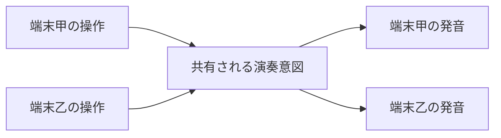

# 格子意図の遠隔共有

この文書は、同じインスタンスの全員が一つの格子を共同操作し、同じ意図から各自が発音する共有方式を決める。共有する意図、所有、状態形、操作の結び付け、同時操作の扱い、音声への反映、開発環境の制約を正本にする。

## 要求元

`requirements/intent/shasavistic-music-world.md` の同期要求（全員が同じ音を聞く、厳密な同期は保証せず簡潔さを優先）を要求元とする。要求を再定義しない。

## 前提

同じインスタンスの全員が一つの格子を共同操作し、共同視聴する。途中参加の端末が共有値を読めることは利用者の確定済み前提として扱い、読めない場合の回復は定めない。ただし共有機構の文書に途中参加の読み保証の明記は確認していないため、厳密な途中参加同期は保証しない（要求の厳密な同期は保証せずによる）。格子・移動・次元切替の意味と操作・音声の分離は親を参照する。

## 確定した方式

共有するのは演奏の意図（選択次元・オンの格子点集合・任意の機能根の座標鍵）だけとする。発振器や実際に鳴っている声は各端末に残し、共有しない。

意図状態の唯一の所有者は、XRift のインスタンス内状態同期（`useInstanceState`、`useState` 互換で関数型更新に対応）に置く。制御器の閉包には置かない。関数型更新の対応は導入済み実装と型定義で確認済み（`@xrift/world-components@0.53.0` の `dist/hooks/useInstanceState.d.ts:19-20,37` と `dist/hooks/useInstanceState.js:52-63`）であり、公式文書の当該節に関数型更新の明記は確認していない。正本は実装と型定義とする。

状態は一つの状態識別子に選択次元・オン点列・任意の機能根（`dimension`・`onPoints`・`functionalRootKey`）として載せ、未指定は `null` とする。機能根はオン点のいずれかの座標鍵とする。識別子の具体名は実装時に定め、ワールド・インスタンス内で一意にする（型定義の `stateId` は一意必須）。オン点列は重複を除き兄弟の固定座標順（`y` 降順、次いで `x` 昇順。`pitch-assignment.md:31`）に正規化した座標鍵の配列とし、直列化できる形にする。現行の `PitchGridIntent` は次元とオン点だけであり、機能根の座標鍵はこの文書の追加分とする。

操作（個別の切替、八方向移動、次元選択、機能根の指定・解除）は共有値への純粋な遷移とし、関数型更新へ渡す。移動は共有集合全体への一括操作とし、次元変更は座標を保ったまま全員の選択次元を変える（親の切替意味と一致）。他人の操作で自分の音が変わるのは共同演奏の帰結として受け入れる。機能根の指定・解除・点オフ時解除・集合移動時追随・次元切替時保持は、この共有意図の遷移として正本化する。指定はオン点のうちから選び直し・解除ができ、対応点がオフになったら解除する。集合移動では根の座標鍵を移動先へ追随させる。次元切替では根の座標鍵を保持する。保持するのは選ばれたオン点の座標と役割であり、その周波数や音程意味の不変性ではない。解音まで自動保持する設計にはしない。指定モード（選択中であること）は各端末の操作状態とし、確定した根の座標鍵だけを共有状態とする。

同時操作の取りこぼし（後に届いた書き込みが残る）は許容する。要求の簡潔さ優先に基づく。

各端末は共有快照の変化を自端末の音へ反映する。点変更は既存の点反映（`setVoices`）、次元変更は切替の専用境界（`switchDimension`）で鳴らし直す。自分の操作と遠隔反映の二重発火を避けるため、同値の再反映の抑止は音声側の継続分岐（同鍵・同周波数は継続し鳴らし直さない）に寄せ、共有側で別途抑止を設けない（兄弟の通常反映を参照）。実際に鳴った声の数と一覧表示（`voiceCount`、`soundingVoices`）は各端末で鳴った声の表示として端末内に保ち、意図の共有と発音成立は別物として扱う。

開発描画（`src/dev.tsx`）は同期機構を注入しないため端末内の動作にとどまり、二画面では同期しない（`shasavistic-music-lab/src/dev.tsx:24` は `XRiftProvider baseUrl="/"` のみで同期実装の注入なし）。検証上の制約とし、合格証拠にしない。

## 採用しない案

- 履歴・書込者選出・冪等合流による方式は採用しない。同時操作の取りこぼしを許容する要求のもとでは選出と合流の運用が重く、簡潔さを損なうためである。実例の `EntryLogBoard` は履歴を状態同期に置き、入退室検知に通知を使い、時刻を共有時計で扱う（公式部品節による）。
- 点ごとに状態識別子を分ける方式は採用しない。識別子の数が格子点分に増え、簡潔さを損なうためである。
- 通知だけの共有（`useInstanceEvent` による意図伝達）は採用しない。一過性の通知であり永続する現在値を持たないため、途中参加者が現在値を読めず、要求の全員が同じ音を聞く意図状態の共有に合わない（公式文書の使い分けでは通知は一時的、状態は永続とされる）。開発環境では同一ブラウザ内のみの到達に限られる。

## 未確定の候補

- 遠隔更新だけで未操作端末の音が始まるかは未確定とし、実機で確かめる。自動再生制限があり、現行音声は利用者操作中の再開を前提とするためである。分かれば、各端末の音声有効化操作と共有値の再反映経路の要否が決められる。
- ホストでの配信順序と原子性は未確定とし、実環境で観測する。近接した同時切替の取りこぼしは許容するが、実際の振る舞いは観測で確かめる。
- 開発用に同期を模す小実装の要否は未確定とし、検証の手間で決める。

## 見直し条件

共有機構で意図の読み書きを保てない場合、許容を超える取りこぼしが共同演奏を壊すと実測で分かる場合、自動再生制限で遠隔反映の発音が成り立たず再反映経路でも解消できない場合、途中参加端末の意図一致が求められる場合は、人間の判断へ戻す。子で親の制約を満たせない場合は子に例外を埋め込まず、親の判断を見直す。

## 検証との接続

方針のみを定め、具体値と判定手順は検証側へ置く。別端末での意図一致と各自発音の判定はホスト環境の一時計画に置き、同時操作の取りこぼしは合否にしない。共有意図の遷移（機能根の指定・解除・点オフ解除・集合移動追随・次元切替保持を含む）は `src/audio/pitchGrid.test.ts` の拡張へ寄せる。未整備であり検証済みとしない。対応する判定処理が完成した項目から一時計画を消す。

## 参照

- `requirements/intent/shasavistic-music-world.md`（同期要求の参照元）
- `workflow/design/shasavistic-music-lab/pitch-grid.md`（格子・移動・切替の意味と操作・音声の分離の参照元）
- `workflow/design/shasavistic-music-lab/pitch-grid/live-audio.md`（音声反映の境界の参照先）
- `research/xrift-world-creation.md`（共有機構の用例と出典の参照先）
- `https://docs.xrift.net/world-components/components/`（通知と状態の使い分け・開発環境の到達範囲・`EntryLogBoard` の方式の参照先）
- `workflow/spec/harmonic-synth-capture.md`（未実行条件の置き先）
